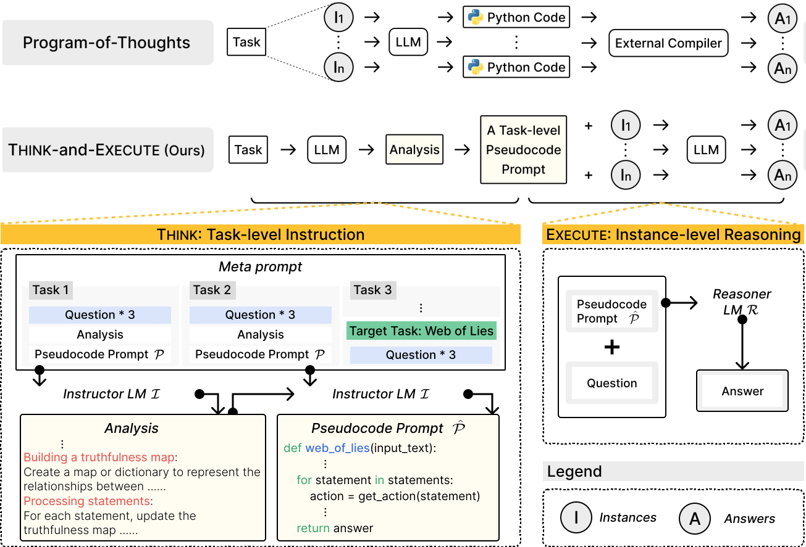

# LanguageModelsasCompilers
---
Official implementation of [Language Models as Compilers: Simulating the Execution Of Pseudocode Improves Algorithmic Reasoning in Language Models](https://arxiv.org/abs/2404.02575).

## Requirements
To run our code, you need an account to access OpenAI API. Generating a pseudocode does not cost much, but running inferences on all instances of a task requires about $10 ~ $20. Also, you need the latest version of vLLM.

## Phase 1: Think - Generating a Task-level Pseudocode
The goal of this phase is to generate a pseudocode prompt that can be applied to all instances of a given task. For that, we conduct following steps:

1. Constructing a meta prompt.
2. Generating an analysis from the example questions of the task. 
3. Generating a pseudocode based on the analysis.

We provide human-written analyses and pseudocodes in `tasks/{task_name}/prompt` folder. Running `generate_analysis.py` will generate an analysis on the selected task and it will be placed at `tasks/{task_name}/generated_prompts` folder.

Then, run `generate_code_prompt.py` to generate a pseudocode for your task. You can check the generated pseudocode prompt at `task/{task_name}/generated_prompts` folder.

## Phase 2: Execute - Simulating the Execution of the Pseudocode
In this phase, we tailor the pseudocode to each instance for conducting reasoning.

Run `scoring_single_prompt.py` with passing the path of the generated pseudocode propmt as an argument.
After the process is finished, you can check the result file in JSON format in `tasks/{task_name}/results` folder.

## Running the Whole Process at Once
After changing the working directory to `src`, run `bash run.sh` to execute the whole process for all tasks we have experimented.

